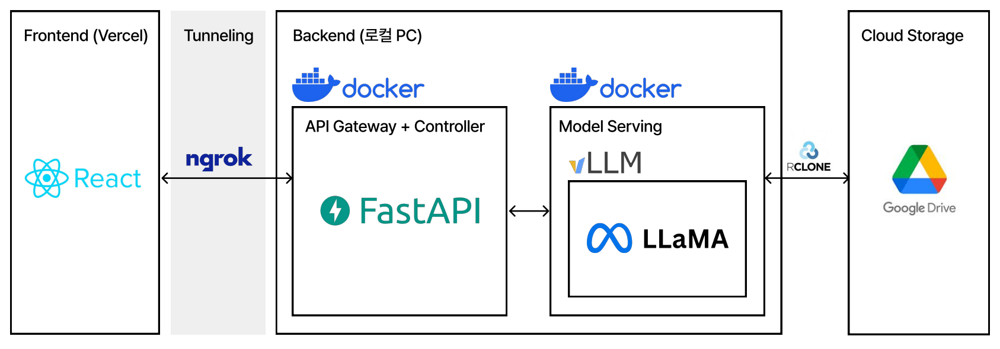

간단한 개요


Track2 아이디어 개발 부문 : K리그-서울시립대 공개 AI 경진대회 참가
https://dacon.io/competitions/official/236648/overview/description


이 저장소는 로컬 서비스 `gateway`와 실험용 `vllm` 디렉토리를 포함한 간단한 LLM 실험 및 배포용 프로젝트입니다. 주요 목적은 모델 파인튜닝(QLoRA), 실험 기록, 그리고 경량 서비스로의 배포 예시를 제공하는 것입니다.




폴더 구조
- `gateway/`: API 진입점, FastAPI 기반 서버 및 도커 설정 (`main.py`, `Dockerfile`, `run.sh` 등).
- `vllm/`: vLLM 관련 실험, Colab 노트북 및 Dockerfile, 데이터셋.
- `app/`: 추가 애플리케이션 진입점 (간단한 runner).
- `services/`: 내부 서비스 로직 (`llm_service.py`) 및 종속 코드.
- `logs/`: 실행 로그 보관용 디렉토리.

빠른 시작

1) 의존성 설치 (개발 환경)

```bash
python3 -m venv .venv
source .venv/bin/activate
pip install -r gateway/requirements.txt
```

2) 로컬 서버 실행

```bash
cd gateway
./run.sh
```

3) 도커로 전체 스택 실행 (docker-compose 사용)

```bash
docker compose up --build
```

vLLM 실험 노트
- `vllm/(colab)Dacon.ipynb`는 Google Colab에서 실행되었으며, NVIDIA A100에서 QLoRA로 LLM 모델 파인튜닝을 수행한 실험 기록입니다.
- vLLM 관련 이미지는 `vllm/Dockerfile`을 참고해 빌드할 수 있습니다.

재현 및 체크포인트
- 실험 재현을 위해서는 Colab 노트북에서 사용한 데이터셋과 체크포인트가 필요합니다. 현재 대화형 데이터(`kleague_sharegpt_final.jsonl`)가 `vllm/`에 포함되어 있습니다.

모델 가중치 동기화 (rclone)
- Colab에서 학습된 모델 가중치는 Google Drive의 `/content/drive/MyDrive/model/kl_league_qlora_out/merged`에 저장되어 있었습니다.
- `rclone`을 사용해 해당 경로를 로컬 머신의 `/home/noh/gdrive/kl_league_qlora_out`로 동기화했습니다.
- 현재 환경 변수는 프로젝트 루트의 `.env`에 설정되어 있으며 주요 항목은 다음과 같습니다:

```dotenv
MODEL_DIR=/home/noh/gdrive/kl_league_qlora_out
MODEL_SUBPATH=merged
```

- rclone 예시 (원격 이름은 사용자의 설정에 따라 다름):

```bash
# 원격이 'drive'로 설정된 경우 예시
rclone sync drive:MyDrive/model/kl_league_qlora_out /home/noh/gdrive/kl_league_qlora_out
```

- 서비스는 `MODEL_DIR`와 `MODEL_SUBPATH`를 결합하여 실제 모델 경로를 찾습니다. 예: `/home/noh/gdrive/kl_league_qlora_out/merged`.


프론트엔드 연동
- 로컬/원격 `gateway` 서비스를 `ngrok`으로 노출하여 프론트엔드와 연결했습니다. 현재 프론트엔드 배포 주소는 https://soccer-tau-olive.vercel.app/ 입니다.
- 프론트엔드 관련 구현 및 설정 정보는 다음 저장소에서 확인할 수 있습니다:

- https://github.com/grden/soccer

- 참고: ngrok을 통해 공개한 URL이 변경될 수 있습니다.

